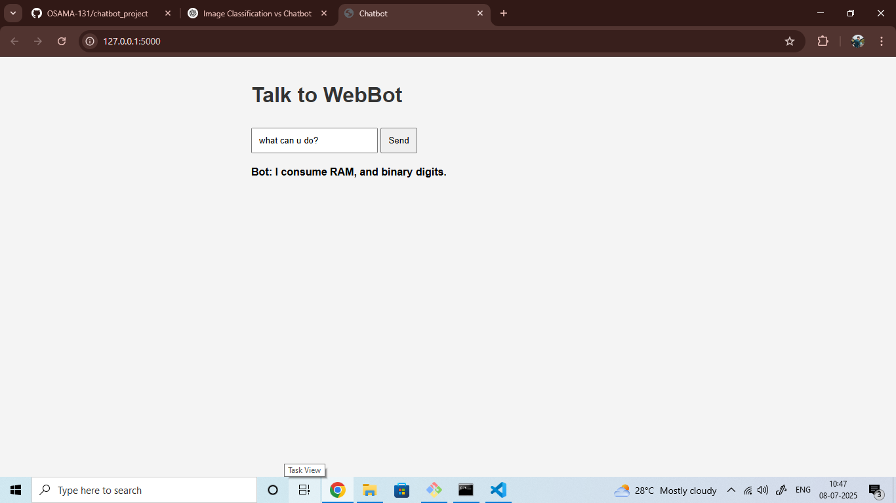
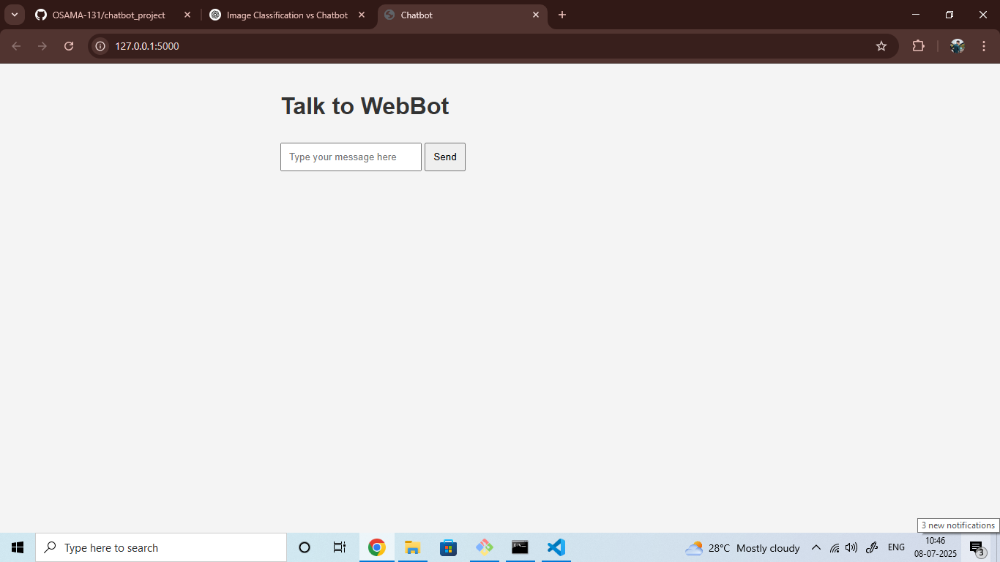

# 💬 AI Chatbot with Flask and ChatterBot

This is a simple AI-powered chatbot web application built with Python, Flask, and ChatterBot. It uses natural language processing (NLP) and machine learning to respond to user inputs in a conversational way.

---

## 🚀 Features

- 🤖 Chatbot powered by [ChatterBot](https://github.com/gunthercox/ChatterBot)
- 🌐 Web-based interface using Flask
- 🧠 Trained on English corpus (customizable)
- 📦 Easy to deploy on Heroku or other platforms
- ✨ Simple and clean UI using HTML + JavaScript

---

## 📸 Screenshots
  ### 🖥️ Chatbot UI


---

## 🛠️ Tech Stack

- **Python 3.8+**
- **Flask** – Web framework
- **ChatterBot** – AI chatbot library
- **HTML + JS** – Frontend interface

---

## 🧪 Getting Started

### 1. Clone the Repository
```bash
git clone https://github.com/OSAMA-131/chatbot-project.git
cd chatbot-project

## install requirements
 - pip install -r requirements.txt

## Download spaCy Language Model (if needed)
 - python -m spacy download en_core_web_sm

## Run the Flask App
 - python app.py

## Visit:-
     http://127.0.0.1:5000


🚀 Deployment
This app is ready to deploy on Heroku. It includes:

- Procfile
- requirements.txt
- runtime.txt

📂 Project Structure
chatbot_project/
│
├── app.py               # Main Flask app
├── requirements.txt     # Python dependencies
├── Procfile             # Heroku process file
├── runtime.txt          # Python version for Heroku
├── templates/
│   └── index.html       # Chat UI
└── README.md            # You're reading it!
├── UI_screenshot/
│   └── imgchatbot.png   # screenshots of UI
│   └── img2chatbot.png    


🙋‍♂️ Author
 – @OSAMA-131


